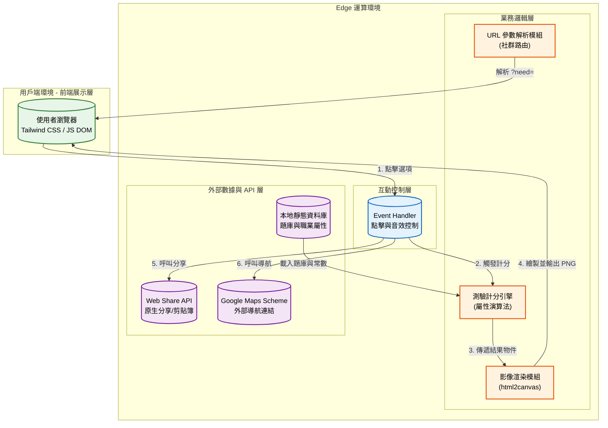

# 三峽職人：手路尋蹤 🎨

## 1. 專案介紹

### 1.1 系統目的簡介

本系統是一款結合地方創生與數位互動設計的單頁式 Web 應用程式 (SPA)。透過沈浸式的情境心理測驗分析使用者的「靈魂屬性」，系統會自動派發專屬的三峽在地職人職業（如木雕匠人、藍染魔法師等），並生成專屬角色卡與任務憑證，將純數位的互動轉化為 O2O（Online To Offline）實體導流，引導旅人進入三峽老街進行實體體驗，進而推動地方文化傳承與商圈永續發展。

---

## 2. 系統架構與範圍

### 2.1 系統架構圖

本系統採用 **資料驅動的無伺服器架構 (Serverless SPA)** 設計，將所有運算集中於邊緣用戶端，並區分為用戶展示、業務邏輯與數據整合層。



### 2.2 系統範圍

* **展示層**: 採用 Tailwind CSS 構建響應式 UI，處理像素風格視覺、掃描線復古濾鏡、動畫轉場以及環境音效（BGM）播放控制。
* **業務邏輯層**: 負責 SPA 狀態管理、實作 MBTI 類型的計分權重演算法、同分隨機抽選機制，以及將 HTML 結構解析轉換為 Canvas 的渲染程序。
* **數據存取層**: 核心在於管理本地 JSON 格式的題庫與職業屬性表，並橋接手機端原生的 `navigator.share` API 與外部地圖深度連結。

### 2.3 交付項目

1. **網頁應用程式**: `index.html` (整合 Tailwind CSS, html2canvas, 核心 JS 邏輯)。
2. **靜態視覺圖庫**: `./assets/images/` 目錄內之職人角色背景圖檔。
3. **沉浸式音效庫**: `./assets/audio/` 目錄內之各職業專屬環境音軌。
4. **系統規格文件**: 本規格書。

---

## 3. 業務功能需求

本節參照使用案例格式描述核心功能。

| 需求編號 | 功能名稱 | 參與者 | 功能描述 | 業務邏輯/備註 |
| --- | --- | --- | --- | --- |
| **FR-01** | **情境互動測驗** | 一般訪客 | 提供 5 道情境選擇題，每次點擊自動進入下一題，並記錄使用者偏好。 | 採用內存陣列即時累加分數，包含 `wood`, `metal`, `ferm` 等 5 大屬性。 |
| **FR-02** | **靈魂屬性演算** | 系統 | 測驗完畢後，系統比對各屬性得分，產生對應的專屬職人角色。 | 內建防呆與同分處理機制，當多屬性最高分相同時，採用陣列隨機分發。 |
| **FR-03** | **動態角色卡生成** | 一般訪客 | 將使用者的測驗結果、雷達圖與專屬說明，封裝成高畫質 PNG 下載。 | 呼叫 `html2canvas` 進行 DOM 截圖，支援 CORS 跨域圖片載入與錯誤佔位圖處理。 |
| **FR-04** | **O2O 任務導航** | 一般訪客 | 依據職人結果提供專屬任務憑證，並支援一鍵開啟實體店家導航。 | 動態組合 URL Scheme：`http://googleusercontent.com/maps.google.com/{店家ID}`。 |
| **FR-05** | **社群招募擴散** | 一般訪客 | 產生「尋找互補隊友」專屬連結，方便發佈招募貼文。 | 優先呼叫行動裝置原生 Share API；若無支援則降級使用 Clipboard API 並跳出 Toast 提示。 |

---

## 4. 非業務功能需求

### 4.1 安全性要求

* **去識別化運作**: 系統全程於 Client-side 運算，無需註冊登入，不收集任何 PII (個人可識別資訊)，無個資外洩風險。
* **資源防護**: 載入外部影像資源時具備跨域限制防護 (`crossorigin="anonymous"`)，避免 Canvas 污染導致圖片輸出失敗。

### 4.2 系統效能

* **輕量化設計**: 單一 HTML 檔案交付，大幅降低 HTTP 請求次數；使用 Tailwind CSS CDN 確保樣式渲染效率。
* **音訊延遲載入**: 環境音軌 (`Audio`) 需等待使用者首次互動 (`unlockAudio`) 後才進行解鎖與播放，符合現代瀏覽器自動播放規範並節省頻寬。

### 4.3 可用性與準確性

* **RWD 跨平台適配**: 支援 `viewport-fit=cover` 與針對行動裝置優化的觸控區域配置，確保在各尺寸手機與平板上流暢運作。
* **無縫降級機制**: 分享機制及圖片載入皆具備 Fallback 備援設計，確保舊版瀏覽器環境下系統仍能正常完成主流程。

---

## 5. 系統介面設計

### 5.1 API 規格

本系統無傳統後端伺服器，以下定義核心組件間的內部狀態傳遞與 URL 路由規格。

#### 介面 A: 社群擴散入口路由 (Routing)

* **Endpoint**: `GET /?need={partner_type}`
* **輸入**: URL 查詢字串
* **輸出**: 改變前端 UI 渲染狀態，顯示客製化歡迎詞。

```json
{
  "query_parameters": {
    "need": "dye"
  },
  "expected_behavior": "系統將攔截參數，並於 Landing 頁面顯示：『你的朋友正在尋找【藍染水魔法師】的隊友！』"
}
```

#### 介面 B: 職人屬性資料結構 (Static Config)

* **Endpoint**: 內部狀態物件 `results[finalResult]`
* **輸入**: 經演算後的最大值鍵名 (如 `"wood"`)
* **輸出**: JSON 格式的角色設定檔，用於動態綁定至 DOM 節點。

```json
{
  "class": "木雕匠人",
  "title": "Lv.1 沉穩的木雕匠人",
  "attr": "專注 / 雕琢 / 棟樑",
  "stats": {
    "str": 60,
    "agi": 40,
    "int": 85,
    "focus": 99
  },
  "action": "接取任務：前往木雕工作室獲得 5 分鐘微體驗",
  "mapUrl": "[https://www.google.com/maps/search/?api=1&query=三峽老街+木雕](https://www.google.com/maps/search/?api=1&query=三峽老街+木雕)",
  "partner": "dye"
}
```

---

## 6. 專案安裝與部署

### 前置需求

* 支援 HTML5 之現代瀏覽器 (Chrome / Edge / Safari / iOS Safari)。
* 本專案為純靜態網頁 SPA，無需設定 Node.js 或 Database 伺服器環境。

### 部署步驟

1. **檔案準備**: 確保 `index.html` 以及 `assets/` 目錄放置於同一根目錄下，且內部圖片與音訊路徑正確無誤。
2. **本地測試**: 
   * 因 `html2canvas` 處理本地圖片可能遇 CORS 限制，建議透過本地伺服器測試（如 VS Code Live Server 或執行 `python -m http.server`）。
3. **雲端部署 (GitHub Pages)**:
   * 將專案推送至 GitHub 儲存庫。
   * 進入 Settings > Pages，將 Source 指向主分支 (main) 的 `root` 目錄。
   * 儲存後即可取得公開網址，完成自動部署。
